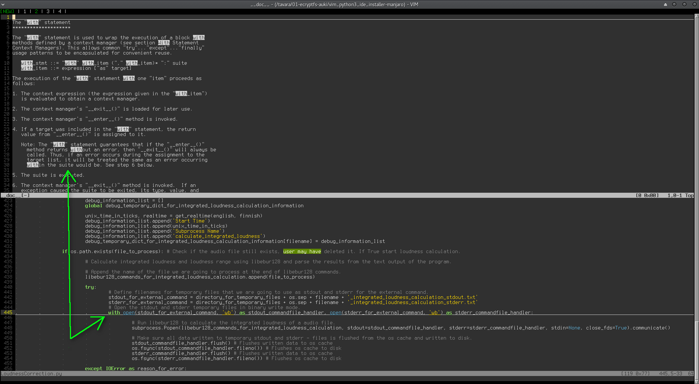
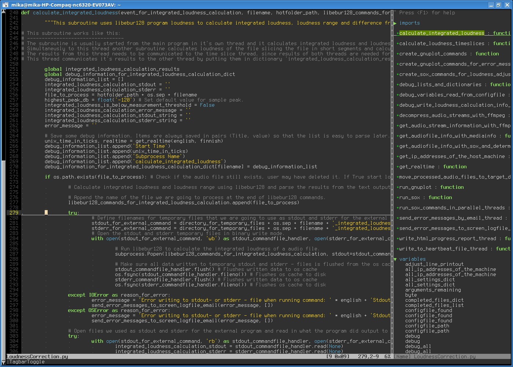
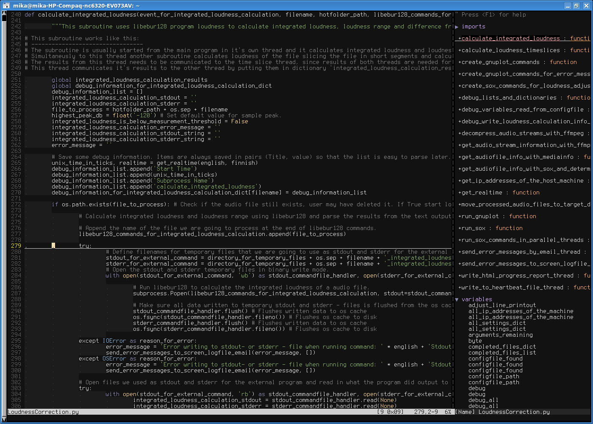
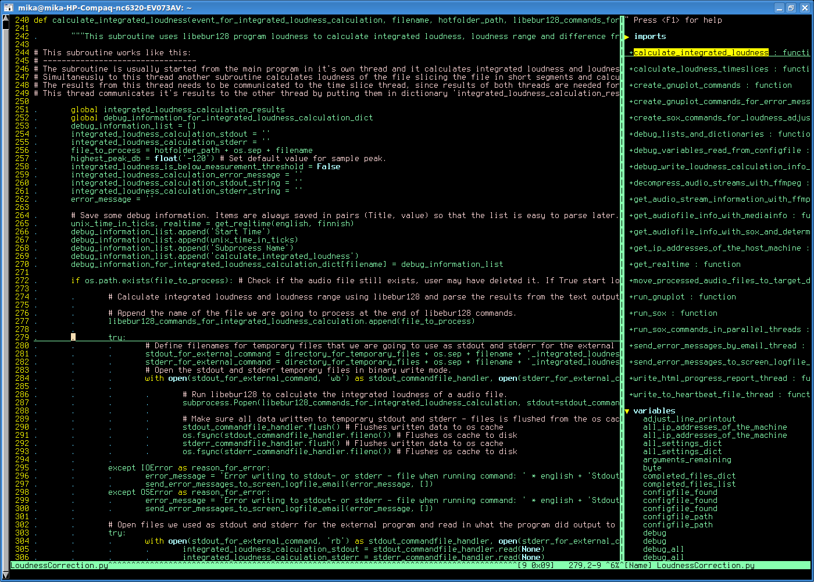

# Vim as Python3 and C IDE

This is my shell script to install vim and other packages so that I can use vim as my Python3 and C development environment.

### This version of the install script is for Debian / Ubuntu.
Gentoo install script can be found here: https://github.com/mhartzel/vim_python3_ide_installer-gentoo

Manjaro install script can be found here: https://github.com/mhartzel/vim_python3_ide_installer-manjaro

This program will do the following things:
- Uninstall previous vim packages and old vim configuration.
- Download latest vim source from git repository. Compile and install a new vim with Python3 support.
- Download and install 256 color capable urxvt terminal emulator and set it up to use clipboard and the Terminus font. Urxvt is the fastest terminal I found and it supports unicode characters and tabs. Terminus font makes code easier to read.
- Install vim plugins Pathogen and Tagbar to make vim an IDE.
- Install Syntastic and Pyflakes.
- Install Supertab and Pydoc.
- Install C language reference documents.
- Remove most color schemes that come with vim, leaving only: default, desert, murphy and slate.
- Install 256 color vim colorschemes: desert256, distinguished, jellybeans, aldmeris (based on oblivion colorscheme for Gedit).
- All colorschemes are modified to show the current line as a 1 pixel underline.
- Aldmeris default color for statements (white) is the same as for the rest of text. Statements should stand out, so the color is changed to green.
- Colorscheme desert256 is set as the default colorscheme.

After installation you have:

- A 256 color and UTF-8 capable terminal emulator urxvt.
- Copy / paste between urxvt and other programs with ctrl + alt + c  and  ctrl + alt + v
- Python3 syntax checking (every time you save).
- Python3 syntax highlighting.
- Python3 documentation for the keyword under cursor opens with leader + pw  ( \pw  NOTE second character must be pressed within 1 second ).
- C syntax checking (every time you save)
- C syntax highlighting.
- C reference documentation for the keyword under cursor opens with leader + cr  ( \cr  NOTE second character must be pressed within 1 second ).
- The current line is underlined with a single pixel white line (all colorschemes). 
- F2 - turns on/off line numbers.
- F3 - turns on/off ident guidelines
- F4 - turns on/off line wrapping
- F5 - turns on/off automatic identation (needs to be turned off when pasting text into vim).
- F6 - jump to next window
- F8 - turns on/off Tagbar.
- Tagbar shows your function names and variables in a small window on the right side of vim display.
- Tagbar also shows you the 'scope' meaning it highlights the function name the current code line belongs to.
- Pressing enter in Tagbar window on a function name makes the main window jump to that function.
- Matching brackets are automatically highlighted.
- Search results are highlighted.
- Case is ignored in search.
- Vim remembers the code line that you were in last time the file was open.
- '' is mapped to `` meaning that the command '' returns to the line and character you were on before a jump in the text.
- Backspace configured to work like it should.


After installation fire up urxvt and start vim in it :)


# Installation

### Requirements: Debian, Ubuntu or another Debian based Linux distro

> git clone https://github.com/mhartzel/vim_python3_ide_installer.git

> cd vim_python3_ide_installer

> ./install_vim_and_packages_required_for_python3_ide.sh


# Screenshots

## Toggle line numbers and indent guides on / off

```ruby
Toggle line numbers on/off with F2
```
```ruby
Toggle indent guides on/off with F3
```


## Tagbar shows the current 'scope' and lets jump to function and variable definitions
```ruby
Toggle Tagbar on/off with F8
```


## Python3 and C syntax checking


## Complete keywords by pressing Tab


## View documentation for the keyword under cursor

```
Python3: leader + pw ( \pw )
```
```
C: leader + cr ( \cr )
```



# Colorschemes

## Desert256 colorscheme


## Aldmeris256 colorscheme (based on oblivion colorscheme for Gedit)



## Distinguished colorscheme (256 colors)


## Jellybeans colorscheme (256 colors)



## Murphy colorscheme (8 colors)



## Slate colorscheme (8 colors)


## Vims own default colorscheme (8 colors)


## Desert colorscheme (8 colors)


